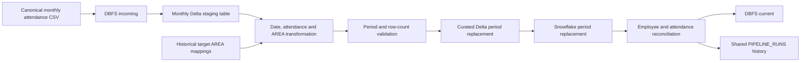

# CEO Asistencia ETL

Production Databricks-to-Snowflake pipeline for the monthly CEO Asistencia
employee attendance snapshot.

The pipeline accepts one canonical CSV, validates that every record belongs to
the filename period, replaces only that period in Delta and Snowflake, validates
final counts, promotes the accepted file, and records a terminal attempt in the
shared pipeline history.

## Business purpose

The dataset combines employee identity, company, attendance date, two
registration values, area enrichment, attendance result, and calculated hours
in `FACT_CEO_ASISTENCIA`. The exact executive report, official row grain,
attendance rules, and downstream Power BI consumers still require confirmation.

## Processing contract

| Item | Contract |
| --- | --- |
| Pipeline identifier | `CEO_ASISTENCIA` |
| Production notebook | `JOB.py` |
| Input location | `dbfs:/FileStore/tables/rh_danone/incoming/` |
| Accepted filename | `CEO_ASISTENCIA_<MM>_<YYYY>.csv` |
| Input unit | One complete monthly snapshot |
| Staging table | `hive_metastore.RH_DANONE.ceo_asistencia_<MM>_<YYYY>` |
| Curated Delta table | `hive_metastore.default.fact_ceo_asistencia` |
| Snowflake target | `PRD_MDP.MDP_STG.FACT_CEO_ASISTENCIA` |
| Period columns | `ANIO`, `NUM_MES`, derived from `FECHA` |
| Load strategy | Replace requested period and validate final counts |
| Success file action | Move canonical file from `incoming/` to `current/` |
| No-input outcome | `SKIPPED` run; no business data change |

## Data flow



## Idempotency and period safety

The code is period-idempotent:

1. The monthly staging table is completely overwritten.
2. Headers are normalized and required input columns are checked.
3. `ANIO` and `NUM_MES` are derived from the parsed attendance `FECHA`.
4. Invalid dates and records outside the filename period stop processing before
   either target is changed. They are no longer silently dropped.
5. The transformed count must equal the source count.
6. Delta replaces only the requested period and validates its final count.
7. Snowflake deletes only the requested period, appends the snapshot, and
   validates that final period rows equal transformed rows.

This is code-level evidence. Runtime proof requires two successful executions
of the same file and period with the same final counts and attendance metrics.

## Attendance and AREA logic

The current business logic is preserved and documented:

- `NUMERO_EMPLEADO` is normalized to eight characters.
- `RESULTADO` is `1` when both registrations parse and the first registration
  hour is at least 06:00; otherwise it is `0`.
- `DIFERENCIA_HORAS` is calculated only when `RESULTADO = 1`.
- source `AREA` is preferred; a missing/blank value is enriched from historical
  non-null target mappings using `NUMERO_EMPLEADO` and `ID`.

The previous join could retain the wrong duplicate `AREA` column. The reference
column is now renamed before the join and explicitly coalesced with source AREA.
When multiple historical areas exist for one employee/ID, the existing
`dropDuplicates` behavior remains; the authoritative selection rule is an open
business question.

## Reconciliation metrics

Each tracked run can capture before/after values for:

- target rows;
- non-null, distinct and null employee-number counts;
- distinct ID and AREA counts;
- records where `RESULTADO = 1`;
- source column count and final curated Delta period rows.

`DIFERENCIA_HORAS` is not summed or averaged until the business confirms
overnight-shift handling, negative-duration rules, exclusions and aggregation.

## Shared run history

Terminal task attempts are appended to the existing shared objects:

- `PRD_MDP.MDP_STG.PIPELINE_RUNS`
- `PRD_MDP.MDP_STG.VW_PIPELINE_RUNS`
- `PRD_MDP.MDP_STG.VW_PIPELINE_DAILY_PERFORMANCE`

Statuses have strict meanings:

- `SUCCEEDED`: Delta and Snowflake writes and validations completed;
- `FAILED`: business processing ended with an exception;
- `SKIPPED`: no CSV was available and no business load was required.

Successful and failed business telemetry is best-effort: telemetry cannot
change a business outcome. A no-input `SKIPPED` write is strict because it is
the only durable result of that execution.

Run duration starts from the Databricks job start timestamp when supplied by the
job; otherwise it starts when the notebook initializes. Compare medians across
equivalent runs and separate cold- from warm-cluster measurements.

## Snowflake authentication

The repository uses RSA key-pair authentication and reads only these secrets:

- scope: `DAN-AM-P-KVT800-R-MDP-DB`
- username: `snowflake-user`
- private key: `Snowflake-Private-Key`

The private key is converted in memory to the PKCS#8 DER/base64 representation
required by the Spark connector. Secret values are never logged.

After pulling credential changes, restart Python or restart the cluster before
testing. Then run `diagnostics/test_snowflake_connection.py`; it executes only
`SELECT 1` and does not read or modify business data.

## Databricks job adoption

`resources/ceo_asistencia_job.yml` is an adoption template, not a replacement
for the live job definition. Preserve the current job name, cluster, schedule,
notifications, retry policy and timeout. Point the production task to `JOB.py`
and add these task parameters:

```yaml
base_parameters:
  tracking_job_id: "{{job.id}}"
  tracking_job_run_id: "{{job.run_id}}"
  tracking_task_run_id: "{{task.run_id}}"
  tracking_task_name: "{{task.name}}"
  tracking_attempt_number: "{{task.execution_count}}"
  tracking_trigger_type: "{{job.trigger.type}}"
  tracking_job_started_at_utc: "{{job.start_time.iso_datetime}}"
  tracking_pipeline_version: REPLACE_WITH_DEPLOYED_GIT_COMMIT_SHA
```

Use the full commit SHA deployed in the Databricks Repo. The template also
recommends `max_concurrent_runs: 1` because concurrent period replacements can
interfere; validate this setting against the live job before adopting it.

## Failure-file policy

The pre-existing production policy is retained: after a CSV has been selected
and business processing fails, every file directly inside `incoming/` is
deleted individually and logged. The folders themselves and `current/` are not
deleted. A discovery or telemetry-only failure before a CSV is selected does
not invoke cleanup.

Deletion is irreversible. A future change should move failed inputs to a
quarantine folder after the source owner approves a retention policy.

## Repository map

| Path | Purpose |
| --- | --- |
| `JOB.py` | Canonical production file orchestration and run tracking |
| `conf/settings.py` | Source, targets, schema and tracking configuration |
| `conf/credentials.py` | Key-pair Snowflake connector options |
| `src/extract.py` | Monthly staging and AREA-reference extraction |
| `src/transform.py` | Attendance derivation, layout validation and enrichment |
| `src/main.py` | Period validation and load orchestration |
| `src/load.py` | Idempotent Delta/Snowflake replacement and validation |
| `src/run_tracking.py` | Reusable terminal-run record model and writer |
| `docs/data_dict.yaml` | CEO Asistencia dataset contract |
| `docs/pipeline_runs_data_dict.yaml` | Shared run-history contract |
| `diagnostics/test_snowflake_connection.py` | Read-only connectivity test |
| `schema/initialize_databricks.py` | One-time DBFS and Hive initialization |
| `schema/pipeline_run_history.sql` | Reference definition for shared objects |
| `resources/ceo_asistencia_job.yml` | Databricks job adoption template |
| `tests/` | Local credential, tracking and source-contract tests |

The two previous competing notebooks and the ad hoc architecture notebook were
removed during consolidation.

## Safe rollout

1. Review and merge the pull request, then pull the final `main` commit into
   Databricks.
2. Point the live task to the repository `JOB.py` notebook.
3. Restart Python or the cluster so imported modules are not cached.
4. Run the read-only Snowflake diagnostic.
5. Confirm the existing shared `PIPELINE_RUNS` objects; do not recreate the
   shared views merely because reference SQL is included here.
6. Add the tracking parameters and deployed full SHA to the live job.
7. Run a valid file and verify one `SUCCEEDED` record.
8. Rerun the same file/period and compare final counts and metrics.
9. Run with `incoming/` empty and verify one `SKIPPED` record.
10. Test `FAILED` only with explicit approval because the retained cleanup
    policy can delete input files.

## Open business confirmations

- Confirm the official business purpose, Power BI reports and owners.
- Confirm the business row grain and logical/composite unique key.
- Confirm the authoritative historical AREA selection rule.
- Confirm attendance rules for early, night and overnight shifts.
- Confirm the required language/locale for `DAY`.
- Confirm target data types/nullability against live Snowflake metadata.
- Confirm monthly volume, SLA and failed-file retention requirements.
